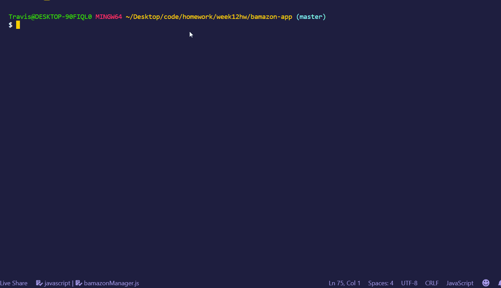

# bamazon-app

# The Two Components
There are two components to this CLI app: a customer view and a manger view.

## Customer View
The customer view allows a customer to look at a table of products and prompted through some actions. User can choose a product and a quantity to purchase. After inputting both the product and quantity, the application shows the total price.

If the user selects an ID that doesn't exist, she is notified that ID doesn't exist and is prompted to enter a correct ID.

If the user selects a quantity greater than that which currently exists, the user is notified how many are left in stock and prompted to change the quantity.

### See the Customer Page in Action
**The Purchase**

**ID Doesn't Exist**

**We Don't Have Enough**

## The Manager's View
The manager's view allows a manager to do a few things: view current inventory, view low inventory, add to inventory and add a new product (admittedly, I never got to the last one.)

After adding to inventory, the user will be notified of current inventory. This can also be confirmed as the inventory will show an update of the new quantity.

### See the Manager Page in Action
**View Inventory**

**View Low Inventory**

**Add Inventory**

**Updated Inventory**
